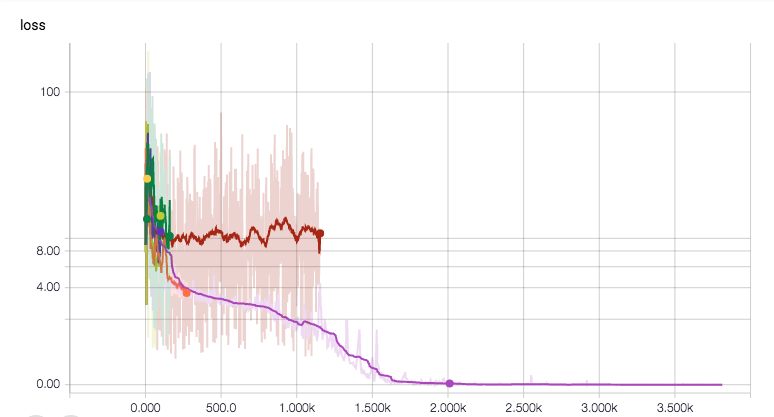
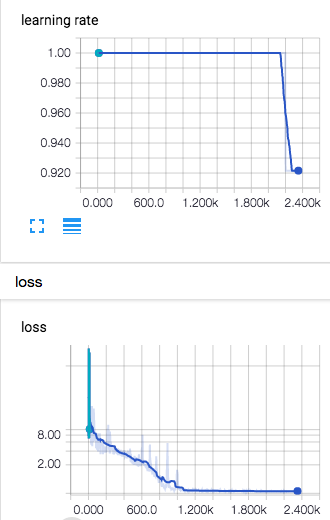
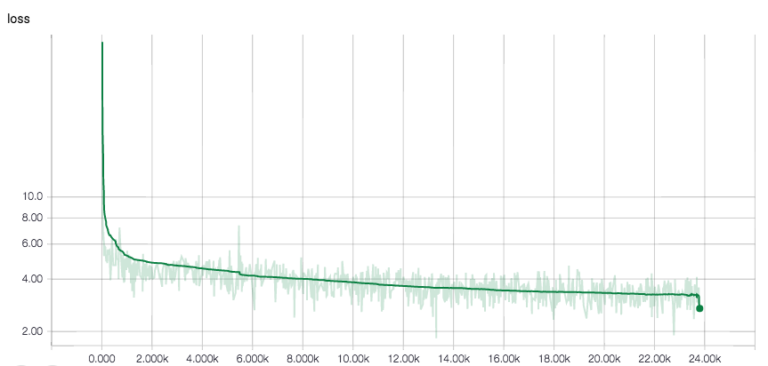
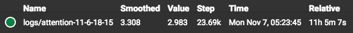

# Attention
## 0. Project structure

- `main.py`: parses the config input and run basic tests
- `data.py`: provides the data iterator and data processing
- `test_iterator.py`: tests the data iterator
- `data\`: training data
- `checkpoints\`: checkpoints of model parameters
- `logs\`: logs of loss, accuracy, etc.
- `model.py`: 
    - `build_variables()`: prepares the variable placeholder
    - `build_model()`: prepares the model
    - `train()`: train the model
    - `test()`: calculate test error
    - `countParameters()`: count the parameters in the model
    - `load()`: load the model from checkpoints
    


## 1. Model architecture and parameters


```python
max_size       = 30
batch_size     = 64
max_epochs     = 10
embedding_size = 128
hidden_size    = 512
LSTM_layer     = 4
drop_out       = 0.2
init_range     = [-0.1, 0.1]
learning_rate  = 1  # anneal every epoch after 5
max_grad_norm  = 5
```

## 2. Improvements
- Seperate the model, main controller and data iterator (MEM)
- Using CPU version of tensorflow for half a week: manually attaching the device but I should let tf do that
    - training overnight and only finished one epoch
    - tf default GPU version is 9x speed up
- Always debug using a simple architecture first, cause the init takes miniutes at least.

## 3. Training debugging
### 3.1. Learning rate annealing  
The previous learning rate decays to quick on small samples:
```
After epoch 5, half the learning rate every epoch.
```

1000 epochs later it go to zero before the data is overfitted yet. There are three solutions:
<!---  --->
<!---  --->

- Still use the exponentially decaying learning rate but basing on iteration steps (also tuning)  
- Try ADAM which does not rely on learning rate that much
    - Blow up in the first several epochs, probably because start with a too high learning rate
- Adaptive learning rate

If we fix the learning rate at 1.0, a 2 layer, 512 hidden states, static LSTM will memorize the 10 samples in 4000 epochs (CE < 1e-3)

#### 3.1.1. Adaptive learning rate
```python
def update_learning_rate(n)
    if best_loss  > best_loss_in_last_n_iteration:
        learning_rate /= 2
```

### 3.2. Penalty for <pad> tokens
We use tf.sequence_loss to calculate the loss between target and prediction, while the prediction after <eos> shouldn`t be penalized actually. One thing we can do is cut off at the length of the target sentence by changing the weights.


## 4.Training experiments
### 4.1. en-vi small dataset

Trained for 11 hours, 24k steps roughtly 10 epochs, although the loss seems to keep dropping. 

- vocab: 17k -> 7k
- speed: 64 pairs of sentences per 1.5s -> 153k per hour
- trian_error = 3-3.3
- test_error = 3.05
- test_perplexity = 26



### 4.2. en-de medium dataset
Trained for 3 hours

- vocab: 5k -> 5k
- speed: 128k pairs of sentences per 3s -> 153k per hour
- trian_error = 5-5.5
- test_error = 5.5
- test_perplexity = 270
    
### Sampling
Although the words are reasonable, the BLEU score is actually not that good. 
There might be still some small bugs in my code. 
```
###########################################################
#### Source sentence
###########################################################
You can &apos;t breath as well . You &apos;ve lost a third of your lung capacity by the age of five .
And even skin infection , which we originally thought wasn &apos;t that big a problem , mild skin infections naught to five give you a greatly increased chance of <unk>
This is a big deal , so the <unk> and crosses on the screen are actually critical for young kids .
Those <unk> and crosses represent the <unk> houses we &apos;ve looked at nationally around Australia , the same proportion .
What you see on the screen -- 35 percent of those <unk> houses lived in by 50,000 indigenous people , 35 percent had a working shower .
Ten percent of those same <unk> houses had safe electrical systems , and 58 percent of those houses had a working toilet .
These are by a simple , standard test : In the case of the shower , does it have hot and cold water , two taps that work , a
Not well designed , not beautiful , not elegant -- just that they function .
And the same test for the electrical system and the toilets .
<unk> for Health projects aren &apos;t about measuring failure .
###########################################################
#### Target sentence
###########################################################
Không không thở được như như dấu ngôi gạch 50.000 xứ trọng trọng trẻ trẻ trẻ đề , , , cùng tỉ tỉ còn tốt , , , 35 mức
cả bệnh ngoài da da lúc lúc lúc giản giản chẳng vòi vòi có có gì , , nóng lạnh còn còn tốt , , , giảm giảm giảm làm
là là thể lớn sang 35 dấu tiện tôi khảo trên trọng trọng 58 trẻ trẻ nhỏ , , , viêm tỉ tỉ còn tốt , , , 2 những
cần đó chuyện lớn nên 35 dấu chúng gạch khảo trên , trọng trẻ trẻ trẻ Úc , , , như tỉ tỉ lệ lệ , , , 35 35
Những gì bạn thấy 35 35 những đầu điện nghĩ , , 35 có vòi vòi đề , , , cùng tỉ tỉ lệ tốt , , 2 , mức
tỉ gì bạn lớn 35 35 những đó <unk> nghĩ <unk> nghiệm 35 58 trẻ trẻ Úc , , 35 cùng tỉ còn lệ lệ , , , mức những
Kết Kết ngoài ngoài nghiệm lúc lúc lúc % từ vòi vòi , , , có lạnh không nóng , , , 2 2 giảm giảm , , , ,
cần cần đẹp , sang trọng hay tiện gạch gạch toàn quan , trẻ trẻ tỉ tỉ lệ , không như như tỉ lệ lệ không , , như như
thống điện điện , trọng khoẻ như giá giá các bại bại trọng như trẻ trẻ trẻ lệ không , như như như lệ lệ lệ , , như như
án Ngôi Ngôi , sức khoẻ khoẻ giá giá thất bại bại , như trẻ trẻ tỉ không , , , không không không không không , , , như

```

## n. Todo list
- [x] Overfitting tests 
- [x] Adaptive learning rate
    - [ ] Annealing in validation
- [x] Removing penalty for <pad>
- [ ] [add validation error summarizer](http://stackoverflow.com/questions/35387109/validation-and-test-with-tensorflow)
- [ ] pretraining the wordvector
- [x] dot product rather concatinating
- [x] bash scripts to download the data and shuffle 
   - [x] shuffle
   - [x] sort by length

